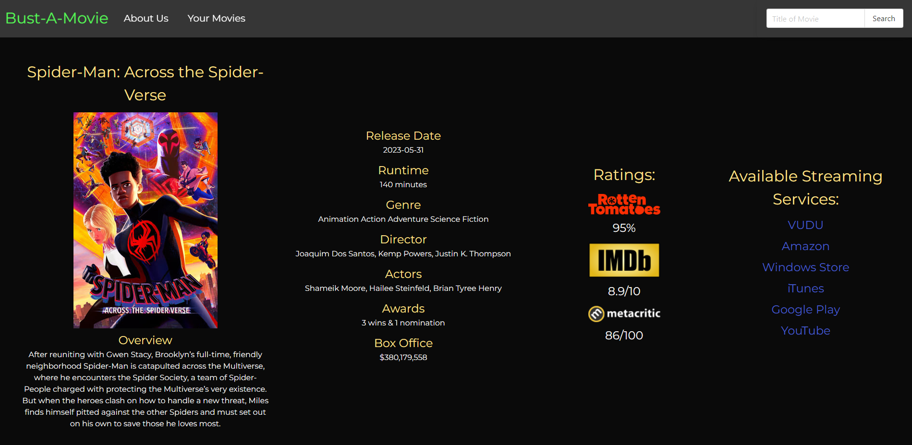

# Bust-A-Movie
UCF Coding Bootcamp - Project 1

## User Story

```
AS A person that wants to watch a movie
I WANT to see where that movie is available to stream, and possibly watch a trailer
SO THAT I can watch that movie or find another one
```

## Acceptance Criteria

```
GIVEN a prompt to search for a movie
WHEN I search for a movie
THEN I am presented with various streaming platforms on which to watch it.
WHEN I click the link to a streaming site
THEN I am taken to that movie's page on that specific streaming site.
WHEN I search for a movie
THEN I am presented with some basic info about that movie (Year released, head actors, trailers)
WHEN I search for a movie
THEN I am presented with the Rotten Tomatoes score for that movie.
WHEN I click the Rotten Tomatoes score
THEN I am taken to the movie's page on Rotten Tomatoes
WHEN I search for a movie
THEN my search is saved to local storage.

```
## Description

The goal of this project was to build a film search engine that seeks to improve user experience. By utilizing multiple server-side APIs, our application provides instant access to all necessary information about consumer’s favorite movies in a single search. With just the click of a few buttons, users have access to plot summaries, movie ratings, and available streaming services for the movie of their choice!


## Finished Project

### Comments

* When the website loads, the user is greeted with a hero banner including the name of site as well as a search bar to begin their movie search.
* When the user searches for a movie, they recieve a variety of movie options matching the parameters of their search.
* Once the user clicks one of the search result options, they will be able to see detail about the movie, an image of the movie, ratings for the movie as well as links to those review sites, and finally websites where the movie is available to stream, as well as link to those sites.
* There is also a Your Movies page that will pull from local storage any movie that the user has recently viewed.
* The website is responsive and is compatible with any size screen.
### Deployed Website

[ Click Here to View Deployed Website](https://newprice247.github.io/Bust-A-Movie/)




## Credits

All of the animated icon gifs were sourced from [Flaticon.com](https://www.flaticon.com/free-animated-icons/weather), and the appropriate attribution to the author Freepik is included at the bottom of the Weather Dashboard page.

All weather data was retrieved via API from [Open Weather Map](https://openweathermap.org/forecast5).

## Contact Me

[Nathaniel Price](https://github.com/newprice247) @ Github

